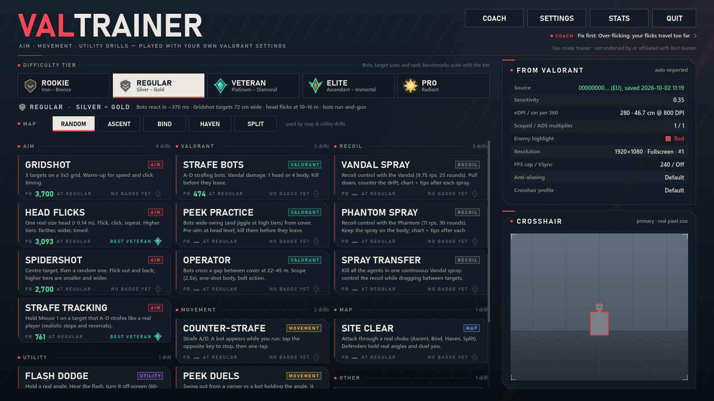
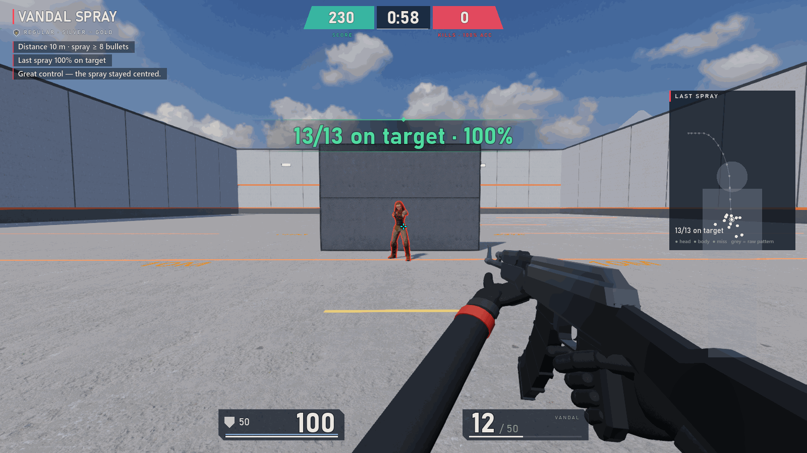
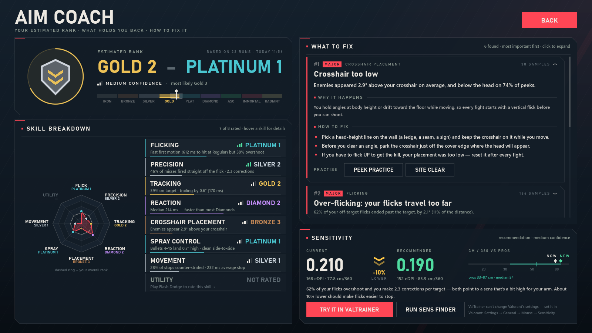
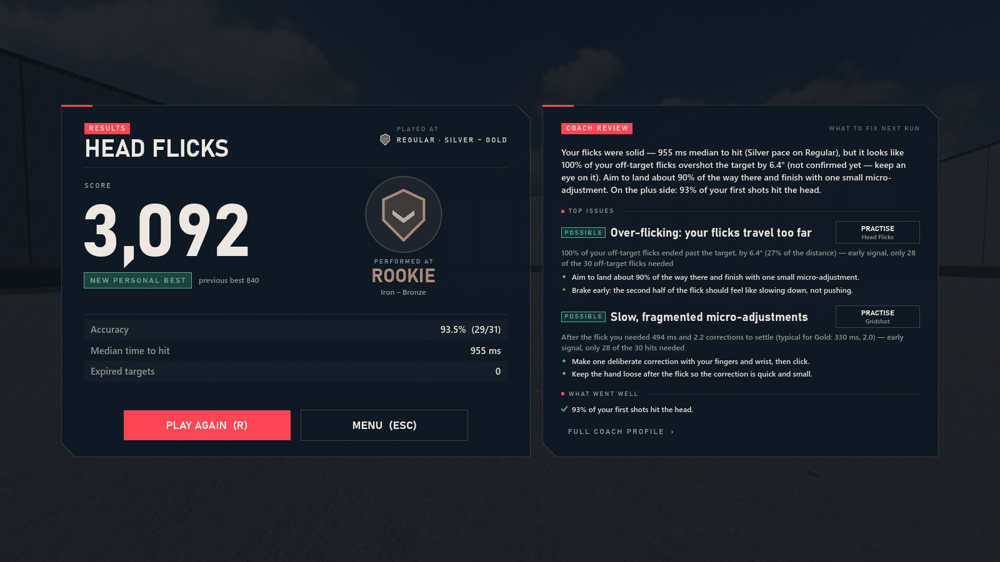

# ValTrainer

[](https://github.com/idoraz1/ValTrainer/actions/workflows/ci.yml)
[](https://github.com/idoraz1/ValTrainer/releases/latest)
[](LICENSE)

**A free aim, movement and utility trainer for VALORANT players.** ValTrainer imports your VALORANT sensitivity, crosshair
and keybinds, so every drill feels like the game. Bots and targets scale to your rank, and an aim coach tells you
what holds you back and how to fix it.

Windows 10/11 · free and open source · fan-made, not affiliated with Riot Games

| | |
|---|---|
|  |  |
| **Menu:** pick a tier and a drill. Your imported VALORANT settings and crosshair are on the right. | **Vandal Spray:** after every spray, a chart shows your bullets against the target and the raw pattern. |
|  |  |
| **Aim coach:** estimated rank, 8 skills, what to fix first, and sensitivity advice. | **Results:** the coach reviews every run, with fixes and what went well. |

<sub>Screenshots use a sample VALORANT profile, simulated runs and the coach's sample data.</sub>

## Contents

- [Download and install](#download-and-install)
- [System requirements](#system-requirements)
- [What it copies from VALORANT](#what-it-copies-from-valorant)
- [Drills](#drills)
- [Difficulty tiers](#difficulty-tiers-calibrated-to-ranks)
- [Weapons](#weapons)
- [Graphics](#graphics)
- [Aim coach and Sens Finder](#aim-coach)
- [Privacy](#privacy)
- [Troubleshooting](#troubleshooting)
- [Building from source](#building-from-source)
- [Roadmap and feature requests](#roadmap-and-feature-requests)
- [License, credits and legal](#license-credits-and-legal)

## Download and install

Get the latest version from **[GitHub Releases](https://github.com/idoraz1/ValTrainer/releases/latest)**. There are two
downloads:

| File | For |
|---|---|
| `ValTrainer-x.y.z-Setup.exe` | **Recommended.** Installs for your Windows user (no admin rights needed) with Start menu shortcuts, including "ValTrainer (safe graphics)", an optional desktop icon and an uninstaller. |
| `ValTrainer-x.y.z-Portable.zip` | No installation: unzip anywhere and run `ValTrainer.exe`. On its first start it unpacks its .NET runtime to a folder in `%LOCALAPPDATA%`. |

Both use the same settings and stats in `%APPDATA%\ValTrainer`, so you can switch between them.

**"Windows protected your PC"?** ValTrainer isn't code-signed yet, so Windows SmartScreen warns about new downloads.
Click **More info → Run anyway**. To check that your download is the official one, compare its SHA-256 hash with
`SHA256SUMS.txt` from the same release:

```powershell
Get-FileHash .\ValTrainer-1.0.0-Setup.exe -Algorithm SHA256
```

**Updates:** once a day ValTrainer asks GitHub whether a newer version is out and shows it on the menu. It never
downloads or installs anything by itself. You can turn the check off in Settings.

## System requirements

- Windows 10 (1607+) or Windows 11, 64-bit. Nothing else to install (.NET is bundled).
- Any GPU with a Vulkan or Direct3D 12 driver gets full graphics. Older GPUs, virtual machines and remote desktop
  switch automatically to a simpler OpenGL/Direct3D 11 mode.
- About 450 MB of disk space.
- VALORANT is optional: without it, ValTrainer uses VALORANT's defaults and you set your sensitivity in Settings.

## What it copies from VALORANT

ValTrainer reads `%LOCALAPPDATA%\VALORANT\Saved\Config` every time it starts.

- **Aim:** sensitivity, plus the scoped and ADS multipliers. It uses the same math as VALORANT: 0.07° per count × sens,
  with a 103° horizontal FOV. The mouse is read as raw input, so your cm/360 is identical.
- **Look:** the crosshair profile, drawn pixel-for-pixel with movement and firing error, and the enemy highlight colour.
- **Controls:** movement, walk and crouch keybinds; hold or toggle scope. The weapon hand (right or left) is a ValTrainer setting, right by default.
- **Display:** resolution, display mode, monitor, VSync and FPS cap.

If several VALORANT accounts have played on the PC, you can pick one in Settings. You can override any of these
settings there too.

**How the import works:** ValTrainer only *reads* VALORANT's settings files, the same text files VALORANT saves your
settings in. It opens them read-only and never changes them. It never touches the game process, its memory or your
input, and it works the same whether VALORANT is running or not. The Sens Finder and the coach's sens advice never
change VALORANT either: you set the new sensitivity yourself in VALORANT's settings.

## Drills

| Category | Drills |
|---|---|
| Aim | Gridshot, Head Flicks, Spidershot, Strafe Tracking |
| VALORANT | Strafe Bots, Peek Practice, Operator |
| Recoil | **Vandal Spray / Phantom Spray**: spray a standing agent and keep it on the body. A spray chart after every spray shows your bullets against the target and the raw pattern, with coaching ("pull down more", "counter the drift right"). Distance and the required spray length scale with the tier. **Spray Transfer**: kill every agent in one continuous spray. |
| Movement | Counter-Strafe, Peek Duels (the bot shoots back) |
| Map | Site Clear: Ascent A Main, Bind Hookah, Haven C Long, Split A Main |
| Utility | Flash Dodge: Phoenix, Breach, KAY/O, Skye, Yoru, Vyse, Gekko, using VALORANT's on-screen blind rule and per-agent timings and sounds |
| Coach | Sens Finder (see below) |
| Other | Reaction Test |

## Difficulty tiers (calibrated to ranks)

| Tier | Ranks | Bot reaction | Bot's median time to kill you in the open |
|---|---|---|---|
| Rookie | Iron–Bronze | 480 ms | ≈4.4 s |
| Regular | Silver–Gold | 370 ms | ≈2.4 s |
| Veteran | Plat–Diamond | 290 ms | ≈1.4 s |
| Elite | Ascendant–Immortal | 225 ms | ≈0.84 s |
| Pro | Radiant | 180 ms | ≈0.53 s |

The low tiers were softened after playtesting: our bots have advantages no human has, such as perfect awareness and no
peeker's advantage for you. In Flash Dodge, Rookie and Regular attackers walk or jog in, swing later, don't pre-aim your
spot, and won't shoot while you're fully blind.

- **How bots fight:** they react with a human-like delay, then move their crosshair onto you (Fitts' law). They fire the
  Vandal with a per-shot hit chance against your 100 HP + 50 shield. They don't kill you instantly.
- **Aim drills:** target sizes, speeds and time limits scale with the tier, using aim-benchmark data.
- **Results:** each result shows the rank tier you performed at. Personal bests are tracked per tier.

## Weapons

- **Vandal:** full auto at 9.75 rounds/s, 25-round magazine. Its recoil follows Riot's documented system:
  - a vertical climb that plateaus;
  - side-locked horizontal drift with a 10% chance to switch sides;
  - spread that grows per bullet;
  - recovery of about 0.375 s after one tap and about 1.3 s after a full spray, with the camera drifting back.
- **Phantom:** 11 rounds/s, 30-round magazine, damage falloff.
- **Operator:** 2.5× scope, bolt action.
- **Movement:** running adds 6° of inaccuracy and walking 3°. You are accurate below 27.5% of run speed, which is what
  makes counter-strafing work.
- **Stop timings:** braking matches Riot's measured Phantom stop times.

The per-bullet recoil numbers are reconstructed; Riot never published them.

## Graphics

Real-time Godot Forward+ rendering:

- PBR materials with a different look per map: Ascent stucco and terracotta, Bind clay and teal tile, Haven whitewash
  and red/gold, Split concrete and neon.
- HDRI skies, sun shadows, AgX tonemapping, ambient occlusion and glow.
- Animated enemy agents with VALORANT-style outlines and red fresnel; walls hide both.
- A first-person viewmodel (gloved hands, recoil, sway, reload, bolt cycle) that never clips into walls.
- Muzzle flash, tracers, bullet-hole decals and per-agent flash effects.

| Preset | FPS on a Quadro P2000 / GTX 1050 at 1080p |
|---|---|
| Low (competitive) | ≈290–360 |
| Medium (default) | ≈130–165 |
| High | ≈75–90 |
| Ultra | ≈60 |

On the first start ValTrainer picks a preset for your PC (Low on integrated, virtual or software GPUs). Change it any
time in Settings.

## Aim coach

Every run records your mouse input, crosshair path, shots and events to `%APPDATA%\ValTrainer\telemetry` (the 80 most
recent runs are kept). The coach analyses them; the method is in
[`ValTrainerGodot/docs/coach_spec.md`](ValTrainerGodot/docs/coach_spec.md).

- **Coach screen** (COACH on the menu):
  - an estimated rank overall and for 8 skills (flicking, precision/micro-adjust, tracking, reaction, crosshair
    placement, spray, movement, utility), each with a confidence level;
  - problems sorted by importance, each with your numbers, why it happens, how to fix it and drills to practise.
    Examples: over-flicking, under-flicking with too many corrections, no micro-adjustment, clicking while still moving,
    slow tracking, jitter, crosshair too low, clumsy stops, late spray pull-down;
  - your strengths;
  - a recommended sensitivity, limited to ±18% per change and kept within 20–80 cm/360.
- **Run review:** the results screen adds a short review of that run: a summary, the top problems with fixes, and what
  went well.
- **Sens Finder:** a blind A/B test of about 13 minutes. You alternate between two unlabelled sensitivities using flicks
  and strafe tracking, and it narrows down (bisects) to the one you score best with. It ends with a recommended VALORANT
  sens, eDPI and cm/360, and a button to use it in ValTrainer. VALORANT itself is never changed; set it yourself in
  VALORANT's settings.

The ratings need data: play Head Flicks, Strafe Tracking, Peek Practice, Counter-Strafe and Vandal Spray a few times each.

## Privacy

- **Nothing is uploaded.** No account, no analytics, no telemetry leaves your PC.
- Your settings, stats and run recordings stay in `%APPDATA%\ValTrainer` on your PC. Delete that folder to reset
  everything.
- The **only** network request is the optional once-a-day update check to `api.github.com`, which asks for the latest
  release of this project. Turn it off in Settings and ValTrainer never goes online.

## Troubleshooting

- **The game won't start or the screen stays black:** use the Start menu shortcut **"ValTrainer (safe graphics)"**, or
  run `ValTrainer.exe --rendering-method gl_compatibility` or `ValTrainer.exe --rendering-driver d3d12`.
- In compatibility mode the **first start can freeze for up to about 30 s** while shaders compile; later starts are fast.
- **Where things are:** settings and stats are in `%APPDATA%\ValTrainer`; logs are in
  `%APPDATA%\Godot\app_userdata\ValTrainer\logs`. Settings → About has buttons to open both and to copy your system
  info for a bug report.
- A damaged settings or stats file is kept as `*.corrupt` and the app starts fresh.
- Numbers always use "." as the decimal point, regardless of Windows region settings.
- Still stuck? [Open a bug report](https://github.com/idoraz1/ValTrainer/issues/new/choose) and attach `godot.log`.

## Building from source

ValTrainer is built with the [Godot Engine](https://godotengine.org) 4.7 (.NET / C#). You need Godot 4.7.2 .NET and the
.NET 8 SDK. [CONTRIBUTING.md](CONTRIBUTING.md) explains how to build, run, test and export it, the dev flags, the
project layout and the release process.

## Roadmap and feature requests

- Ideas and plans: [open feature requests](https://github.com/idoraz1/ValTrainer/issues?q=is%3Aissue+is%3Aopen+label%3Afeature).
  Give the ones you want a 👍.
- Suggest a drill or feature, or report a bug: [new issue](https://github.com/idoraz1/ValTrainer/issues/new/choose).
- What changed in each version: [CHANGELOG.md](CHANGELOG.md).

## License, credits and legal

Copyright (C) 2026 ValTrainer contributors.

ValTrainer is free software: you can redistribute it and/or modify it under the terms of the
**GNU General Public License, version 3 or (at your option) any later version** (SPDX: `GPL-3.0-or-later`). See
[LICENSE](LICENSE). It is distributed in the hope that it will be useful, but without any warranty.

All 3D models, textures, skies and recorded sounds are CC0 (public domain); see
[`ValTrainerGodot/CREDITS.md`](ValTrainerGodot/CREDITS.md). Synthesized sounds and procedural effects are original.
The Godot Engine and the bundled .NET runtime are MIT-licensed. CC0 and MIT are both compatible with the GPL; the
installer and the portable zip include their license notices in `THIRD-PARTY-NOTICES.txt`.

ValTrainer uses no Riot art, audio or models, because Riot's fan policy forbids its IP in games and apps. ValTrainer is
fan-made and is not endorsed by or affiliated with Riot Games. VALORANT and its agent and map names are trademarks of
Riot Games, Inc.
